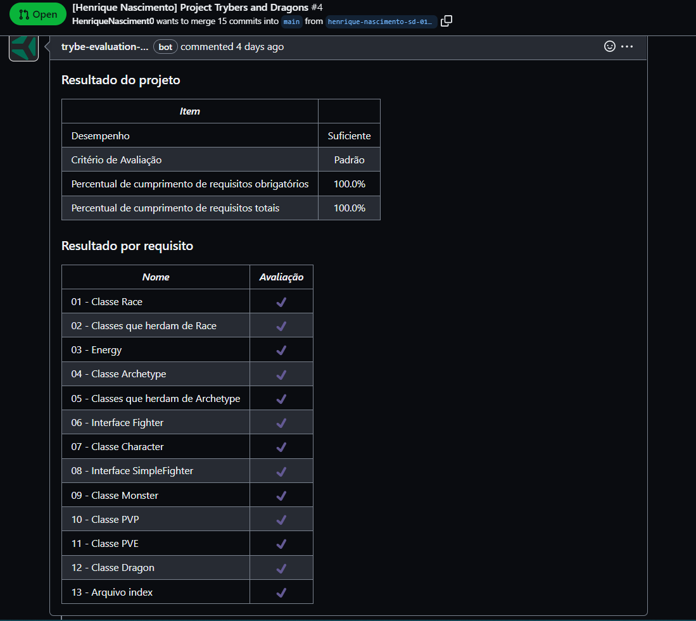

# Project 27 - Tryber and Dragons

Para este projeto, tive de aplicar os princípios da arquitetura SOLID e os princípios de POO em uma estrutura de jogos de interpretação de papéis, mais conhecidos como jogos RPG (Role Playing Game).

<details>
  <summary><strong>👨‍💻 Meu resultado</strong></summary><br />

</details>

## 🚀 Tecnologias

* _Bash_
* _TypeScript_

## 📌 Habilidades
Desenvolvi as seguintes habilidades:

* Oportunidade de usar Interfaces e Classes TypeScript
* Aplicar principios do SOLID
* Trabalhar com métodos privados e protegidos

## ⬇️ Instalando dependências
 ```
 npm install
 ```

## 🧪 Verificando o que foi feito

* No arquivo `/src/index.ts` é possível verificar cada variável com um `console.log`.


<div>
  <a href = "mailto:hsncorretor@gmail.com"></a>
  <a href="https://www.linkedin.com/in/henriquen-dev/" target="_blank"></a>
    <a href="https://instagram.com/henrique.s.nasc" target="_blank"></a>
</div>
